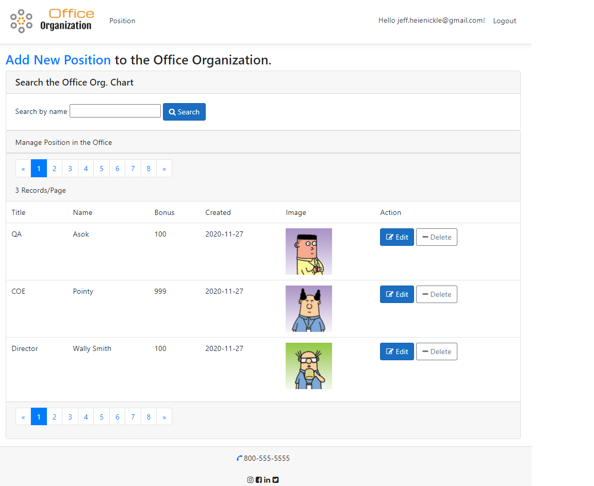

# Office
Office Organization Tracker 

A sample application built using ASP.NET Core and Entity Framework Core. The application use (Model-View-Controller), dependency injection, and SQL Server Express LocalDB. 

The architecture uses a layered approch with a presentation layer made up of the controllers and views that interact with the user, and a core service layer that contains business logic and database code.
## Technologies
* .NET Core 3
* ASP.NET Core 3
* Entity Framework Core 3
* SQL Server Express
see script to create required db schema [here](script.sql)

# Screen
